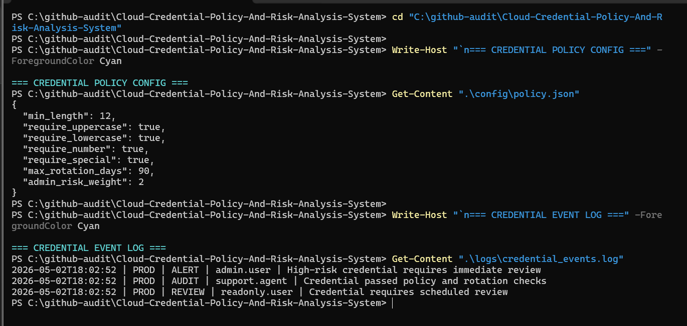
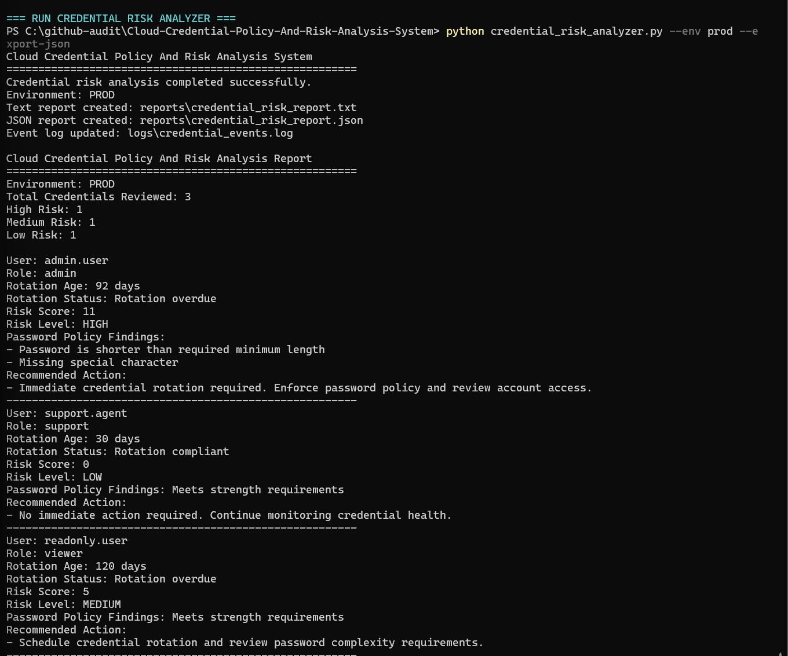

# Cloud Credential Policy And Risk Analysis System

## Overview

This project simulates a cloud identity support tool used to evaluate credential strength, rotation compliance, access risk, and audit visibility across multiple user roles.

It reflects how cloud support and security operations teams review credential health, prioritize risky accounts, and produce structured reports for access governance.

---

## Project Objective

To analyze credential records using configurable policy rules, role-based risk weighting, environment-aware logging, and report generation.

The system focuses on:

- Password Strength Validation
- Credential Rotation Review
- Configurable Security Policy Rules
- Role-Based Risk Scoring
- Risk Classification
- Audit, Review, And Alert Logging
- Human-Readable And Machine-Readable Reporting

---

## Simulated Environment

- Cloud Identity And Access Management Environment
- Multiple User Roles With Credential Records
- Configurable Password Policy Enforcement
- Credential Rotation Monitoring
- Risk-Based Account Review
- Environment-Specific Audit Logging
- Report Generation For Support And Security Review

---

## Security Scenario

A cloud support team needs to review credential records for policy compliance and access risk.

Weak, overdue, or privileged credentials may increase the risk of unauthorized access, account compromise, privilege misuse, compliance gaps, and poor identity security hygiene.

---

## System Architecture

- Config Layer: External Policy Configuration
- Data Layer: JSON Credential Request Records
- Policy Layer: Password Strength And Rotation Rules
- Risk Layer: Risk Scoring And Classification
- Logging Layer: Environment-Tagged Audit, Review, And Alert Events
- Reporting Layer: Text And JSON Credential Risk Reports

---

## Credential Policy Configuration

The system uses config/policy.json to define password and rotation requirements.

| Requirement | Rule |
|---|---|
| Minimum Length | 12 Characters |
| Uppercase Letter | Required |
| Lowercase Letter | Required |
| Number | Required |
| Special Character | Required |
| Rotation Window | 90 Days Maximum |
| Admin Role | Additional Risk Weight |

---

## Risk Classification

| Risk Level | Meaning |
|---|---|
| HIGH | Immediate Review Required |
| MEDIUM | Scheduled Review Recommended |
| LOW | No Immediate Action Required |

---

## Diagnostic Workflow

1. Load Policy Configuration
2. Load Credential Records
3. Validate Password Strength
4. Check Credential Rotation Age
5. Apply Role-Based Risk Weighting
6. Calculate Risk Score
7. Classify Risk Level
8. Log Audit, Review, Or Alert Events
9. Generate Human-Readable Report
10. Optionally Export Machine-Readable JSON Report

---

## Output Files

The system generates:

- reports/credential_risk_report.txt
- reports/credential_risk_report.json
- logs/credential_events.log

---

## Screenshots

### Credential Policy Check

### Credential Risk Report

---

## Project Structure

- config/policy.json
- data/credential_requests.json
- reports/credential_risk_report.txt
- reports/credential_risk_report.json
- logs/credential_events.log
- screenshots/credential-policy-check.png
- screenshots/credential-risk-report.png
- credential_risk_analyzer.py
- README.md
- requirements.txt

---

## Technologies Used

- Python
- JSON
- Config-Driven Policy Validation
- Risk Scoring
- CLI Execution
- Environment-Aware Logging
- Compliance-Style Reporting

---

## How To Run

Run the standard analysis:

python credential_risk_analyzer.py

Run production-style analysis with JSON export:

python credential_risk_analyzer.py --env prod --export-json

Then review:

- reports/credential_risk_report.txt
- reports/credential_risk_report.json
- logs/credential_events.log

---

## Planned Enhancements

- Add Multi-Factor Authentication Status Checks
- Add Account Lockout Simulation
- Add Credential Expiration Alerts
- Add CSV Export For Audit Teams
- Build Dashboard View For Credential Health Monitoring
- Add Integration-Ready Output For Cloud Identity Reporting

---

## Real-World Relevance

This project reflects cloud support and identity operations responsibilities such as:

- Reviewing Credential Security
- Enforcing Password Policies
- Tracking Rotation Compliance
- Prioritizing Account Risk
- Supporting Access Governance
- Producing Audit-Ready Reports
- Generating Integration-Ready Operational Output

---

## Professional Positioning

This project is designed as an entry-level cloud identity support and credential risk analysis simulation.

It demonstrates the ability to evaluate credential health, apply security policy rules, classify risk, generate audit logs, and produce structured reports.
